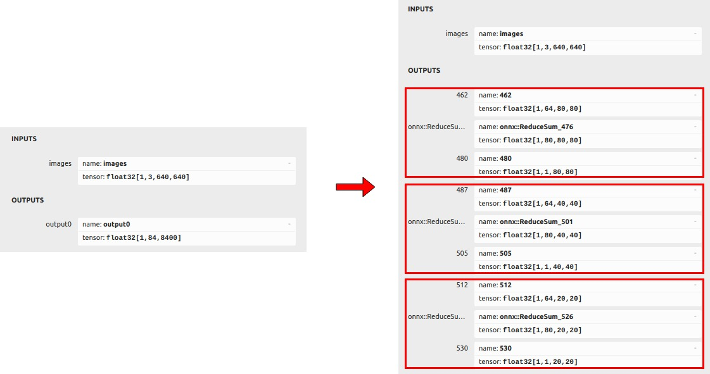
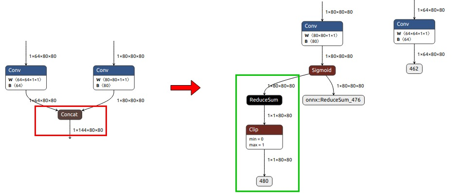
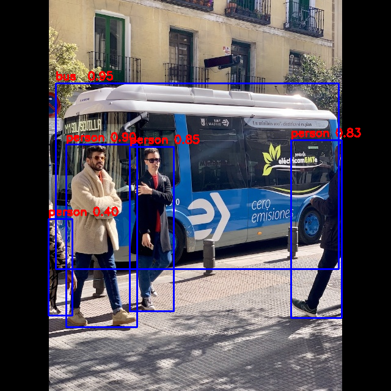

# yolo11

## 目录

- [1. 描述](#1-描述)
- [2. 当前支持平台](#2-当前支持平台)
- [3. 预训练模型](#3-预训练模型)
- [4. 转换为 RKNN](#4-转换为-rknn)
- [5. Python 示例](#5-python-示例)
- [6. Android 示例](#6-android-示例)
  - [6.1 编译构建](#61-编译构建)
  - [6.2 推送示例文件到设备](#62-推送示例文件到设备)
  - [6.3 运行示例](#63-运行示例)
- [7. Linux 示例](#7-linux-示例)
  - [7.1 编译构建](#71-编译构建)
  - [7.2 推送示例文件到设备](#72-推送示例文件到设备)
  - [7.3 运行示例](#73-运行示例)
- [8. 预期结果](#8-预期结果)

## 1. 描述

本示例中使用的模型来自以下开源项目：

https://github.com/airockchip/ultralytics_yolo11

## 2. 当前支持平台

RV1103、RV1106、RK3562、RK3566、RK3568、RK3576、RK3588、RV1109、RV1126、RK1808、RK3399PRO

## 3. 预训练模型

下载链接：

[./yolo11n.onnx](https://ftrg.zbox.filez.com/v2/delivery/data/95f00b0fc900458ba134f8b180b3f7a1/examples/yolo11/yolo11n.onnx)<br />[./yolo11s.onnx](https://ftrg.zbox.filez.com/v2/delivery/data/95f00b0fc900458ba134f8b180b3f7a1/examples/yolo11/yolo11s.onnx)<br />[./yolo11m.onnx](https://ftrg.zbox.filez.com/v2/delivery/data/95f00b0fc900458ba134f8b180b3f7a1/examples/yolo11/yolo11m.onnx)

使用 shell 命令下载：

```
cd model
./download_model.sh
```

**注意**：关于导出 yolo11 onnx 模型，请参考 [RKOPT_README.zh-CN.md](https://github.com/airockchip/ultralytics_yolo11/blob/main/RKOPT_README.zh-CN.md) / [RKOPT_README.md](https://github.com/airockchip/ultralytics_yolo11/blob/main/RKOPT_README.md)

**注意**：这里提供的模型是经过优化的模型，与官方原始模型不同。以 yolo11n.onnx 为例说明它们之间的区别。
1. 它们的输出信息对比如下。左边是官方原始模型，右边是优化后的模型。如图所示，原始模型的输出分为三组。例如，在输出集合 ([1,64,80,80],[1,80,80,80],[1,1,80,80]) 中，[1,64,80,80] 是框的坐标，[1,80,80,80] 是对应 80 个类别的框的置信度，[1,1,80,80] 是 80 个类别的置信度之和。

<div align=center>
  
</div>

2. 以输出集合 ([1,64,80,80],[1,80,80,80],[1,1,80,80]) 为例，我们移除模型中两个卷积节点后面的子图，保留这两个卷积的输出 ([1,64,80,80],[1,80,80,80])，并添加一个 reducesum+clip 分支来计算 80 个类别的置信度之和 ([1,1,80,80])。

<div align=center>
  
</div>

## 4. 转换为 RKNN

*用法：*

```shell
cd python
python convert.py <onnx_model> <TARGET_PLATFORM> <dtype(optional)> <output_rknn_path(optional)>

# 例如：
python convert.py ../model/yolo11n.onnx rk3588
# 输出模型将保存为 ../model/yolo11.rknn
```

*说明：*

- `<onnx_model>`: 指定 ONNX 模型路径。
- `<TARGET_PLATFORM>`: 指定 NPU 平台名称。例如 'rk3588'。
- `<dtype>(可选)`: 指定为 `i8`、`u8` 或 `fp`。`i8`/`u8` 用于量化，`fp` 不进行量化。默认为 `i8`/`u8`。
- `<output_rknn_path>(可选)`: 指定 RKNN 模型的保存路径，默认保存在 ONNX 模型所在目录，文件名为 `yolo11.rknn`

## 5. Python 示例

*用法：*

```shell
cd python
# 使用 PyTorch 模型或 ONNX 模型进行推理
python yolo11.py --model_path <pt_model/onnx_model> --img_show

# 使用 RKNN 模型进行推理
python yolo11.py --model_path <rknn_model> --target <TARGET_PLATFORM> --img_show
```

*说明：*

- `<TARGET_PLATFORM>`: 指定 NPU 平台名称。例如 'rk3588'。

- `<pt_model / onnx_model / rknn_model>`: 指定模型路径。

## 6. Android 示例

**注意：RK1808、RV1109、RV1126 不支持 Android。**

#### 6.1 编译构建

请参考 [Compilation_Environment_Setup_Guide](../../docs/Compilation_Environment_Setup_Guide.md#android-platform) 文档来设置交叉编译环境并完成 C/C++ 示例的编译。
**注意：请将模型名称替换为 `yolo11`。**

#### 6.2 推送示例文件到设备

通过 USB 端口连接设备后，推送示例文件到设备：

```shell
adb root
adb remount
adb push install/<TARGET_PLATFORM>_android_<ARCH>/rknn_yolo11_demo/ /data/
```

#### 6.3 运行示例

```sh
adb shell
cd /data/rknn_yolo11_demo

export LD_LIBRARY_PATH=./lib
./rknn_yolo11_demo model/yolo11.rknn model/bus.jpg
```

- 运行后，结果将保存为 `out.png`。要在主机上查看结果，请使用以下命令拉回结果：

  ```sh
  adb pull /data/rknn_yolo11_demo/out.png
  ```

- 输出结果请参考 [预期结果](#8-预期结果)。

## 7. Linux 示例

#### 7.1 编译构建

请参考 [Compilation_Environment_Setup_Guide](../../docs/Compilation_Environment_Setup_Guide.md#linux-platform) 文档来设置交叉编译环境并完成 C/C++ 示例的编译。
**注意：请将模型名称替换为 `yolo11`。**

#### 7.2 推送示例文件到设备

- 如果设备通过 USB 端口连接，推送示例文件到设备：

```shell
adb push install/<TARGET_PLATFORM>_linux_<ARCH>/rknn_yolo11_demo/ /userdata/
```

- 对于其他开发板，请使用 `scp` 或其他方式将 `install/<TARGET_PLATFORM>_linux_<ARCH>/rknn_yolo11_demo/` 下的所有文件推送到 `userdata`。

#### 7.3 运行示例

```sh
adb shell
cd /userdata/rknn_yolo11_demo

export LD_LIBRARY_PATH=./lib
./rknn_yolo11_demo model/yolo11.rknn model/bus.jpg
```

- RV1106/1103 的 LD_LIBRARY_PATH 必须指定为绝对路径。例如：

  ```sh
  export LD_LIBRARY_PATH=/userdata/rknn_yolo11_demo/lib
  ```

- 运行后，结果将保存为 `out.png`。要在主机上查看结果，请使用以下命令拉回结果：

  ```
  adb pull /userdata/rknn_yolo11_demo/out.png
  ```

- 输出结果请参考 [预期结果](#8-预期结果)。

## 8. 预期结果

本示例将打印测试图像检测结果的标签和相应的分数，如下所示：

```
person @ (108 236 224 535) 0.898
person @ (212 240 284 509) 0.847
person @ (476 229 559 520) 0.827
person @ (79 358 118 516) 0.396
bus  @ (91 136 554 440) 0.948
```



- 注意：不同平台、不同版本的工具和驱动可能会有略微不同的结果。